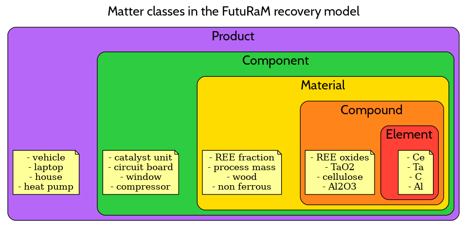

# Futuram Recovery Model

<<<<<<< HEAD
## Table of Contents

This repository contains:  
- `doc/` the documentation about recovery model  
- `src/` the source code of the recovery model  
- `data_folder/` mock data to test the model  

=======
[Go to Documentation](https://futuram-model-docs.readthedocs.io)

## Installation

1. Clone the repository to your local machine (or download the [zip file](https://github.com/FutuRaM-Project/IntegratedModel/archive/refs/heads/main.zip))
2. Run
   > bash auto_install.sh to install everything (may require 'chmod +x auto_install.sh' first)

   Or

   >In the root directory of the repository, run `pip install ./src` to install the package

3. You can now import the package in python with `import futuram as f`
   * See src/examples/ELV to get an idea how it can work
   * See classes for the different objects in the model

## Development

You can install the package in editable mode by running `pip install -e ./src` in the root directory of the repository.
This means that you can make changes to the code and test them live, without having to reinstall the package.

If you make changes to the code, do it in your own branch and make a pull request to the main branch when you are done.

## Overview of the classes in system model

## Overview of matter classes in the model

>>>>>>> main

## Using this model

To use the model, you can add a new folder to 'data_folder' and add 4 files to the input_data folder in that folder:
- inflows.csv -- Defines the inflows per resource
- composition.csv -- Defines the composition of each resource
- TCs.csv -- Defines the transfer coefficients

<<<<<<< HEAD
Then, specify your data folder in the run_model.py or run_model.ipynb file and execute it. Your data will be saved to an output folder within the folder you created.
The definitions for how these tables should be formatted can be found in /doc/user_guide.docx. 

## To Do list

- [ ] write routine for mass balance check:
  - [ ] for the composition
  - [ ] for the entire system
- Implement input validation to ensure no issues occur due to invalid inputs
- [ ] Implement code to automatically execute the model for each different year/scenario
- [ ] Investigate methods to speed up the model for large datasets
- [ ] Define how uncertainty and data quality should be propagated
=======
* connect the parameters the rest of the model, 
add subclasses to parameters for the different kinds

* create efficient way to solve the model flows
>>>>>>> main
