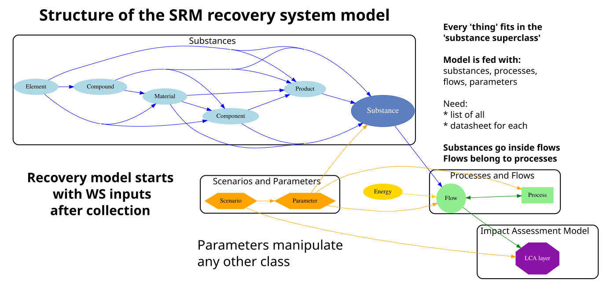

# Futurama system model

SM: I have started building up a draft structure for the integrated model  

*See example_usage.py to get an idea how it can work  
*See classes for the different objects in the model  

## Diagram of the system model

TODO:  
    * establish/connect templates for process and product data
